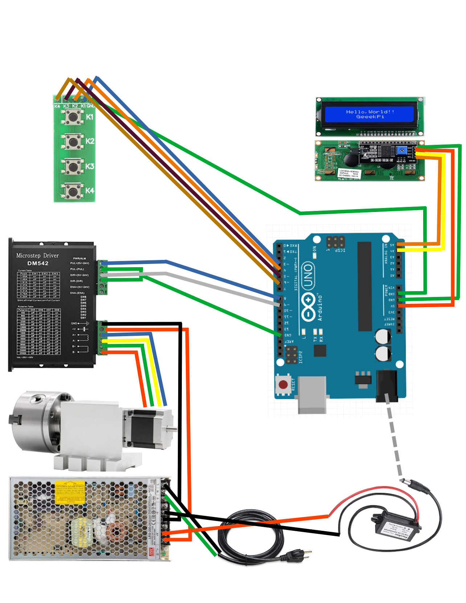

# Background

Wanted the ability to mill multiple sides of something (also known as 3+1 milling). For instance, to mill the chess piece the "knight", you need to mill multiple sides. Also, wanted the ability to cut gears, but did not really want to go the really manual dividing head route. When I saw this [video by Daniel Busby](https://www.youtube.com/watch?v=1Cl9l5O7EEI) , I was inspired to make something similar.

I already had this item: [4 jaw chuck](https://a.aliexpress.com/_mOB9M1P) for when I setup a 4th axis on a PrintNC, I just needed a way to drive it. But, in the course of testing this, I swapped out the motor to [this one](https://www.amazon.com/gp/product/B0B6N36NQJ).

# Components:
- [4 jaw chuck with stepper](https://a.aliexpress.com/_mOB9M1P) (went with 50:1 option)
- [stepper driver](https://www.amazon.com/gp/product/B07YWZRXGR)
- [Arduino Uno Rev3](https://www.amazon.com/dp/B008GRTSV6)
- [power supply](https://www.amazon.com/gp/product/B077BN32KZ)
- [power the arduino](https://www.amazon.com/dp/B07V6X6L89?ref=ppx_yo2ov_dt_b_product_details&th=1)
- [barrel connector](https://www.amazon.com/43x2pcs-Connectors-Security-Lighting-MILAPEAK/dp/B072BXB2Y8)
- [4 position connectors](https://www.amazon.com/gp/product/B083GR7FQF)
- [4 position keypad](https://www.amazon.com/gp/product/B07PFK5Z7L/)
- [LCD](https://www.amazon.com/dp/B07S7PJYM6)
- [box to hold everything](https://www.amazon.com/dp/B08282SQPT?ref=ppx_yo2ov_dt_b_product_details&th=1)
- [glands to keep it somewhat water resistant](https://www.amazon.com/dp/B09WQCF6TQ?ref=ppx_yo2ov_dt_b_product_details&th=1)
- [cables to make it easier to connect things](https://www.amazon.com/gp/product/B01EV70C78)

# Wiring:
- Arduino/LCD: 4 wires (5V power, ground, and two analog pins A4 and A5)
- Arduino/Keypad: 5 wires (ground, and 4 digital pins 3,4,5, and 6)
- Arduino/Stepper driver: 3 wires (ground, digital pins 8 and 9)
- Stepper motor/stepper driver: ensure each loop is together (in my case red/green is one loop, yellow/blue was the other loop); soldered on connector and cat 5 cable to make the cabling longer
- Power Supply/Stepper driver: red V+, black "ground" is V- ; there should be a green light on the stepper driver (the red light should be off); there should be a green light on the power supply
- Power Supply/Aruduino power(buck converter): red V+, black V-, DC barrel plug

The Libre Office drawing is in this directory.

# Buttons:
- first button reduces the total number of passes (**-Total**)
- second button increases the total number of passes (**+Total**)
- third button goes back to the prior pass (**-Pass**)
- fourth button advances to the next pass (**+Pass**)

Typical use would be to change the number of passes you would want (example: 30 if you want 30 teeth gear). Make the first cut, then press the **+Pass** button to advance the chuck for the next cut. If you need to go back, you can press the **-Pass** button.

# Files:
- source code [passes.ino](passes.ino)
- stl for [lcd faceplate](lcd faceplate.stl)
- stl for [keypad faceplate](keypad faceplate.stl)
- wiring diagram [wiring.odg](wiring.odg)

# keywords:
Gear cutting, poor man's fourth axis, automated dividing head
