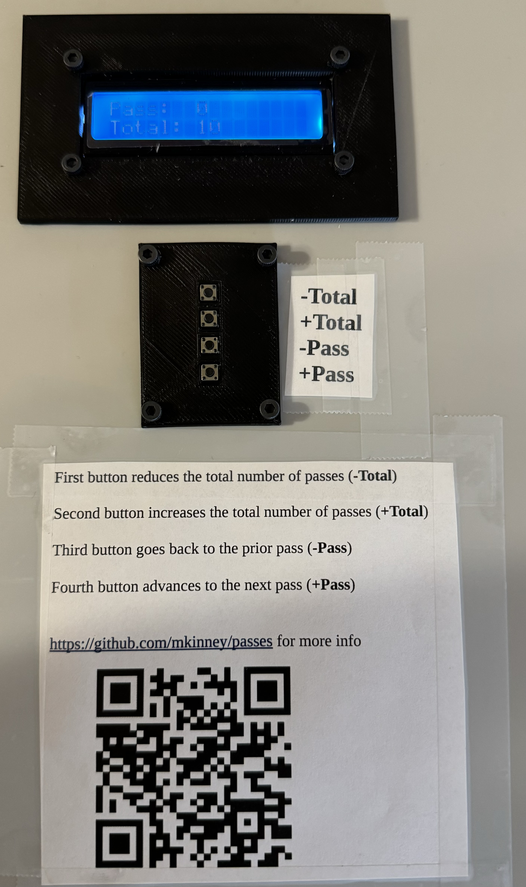
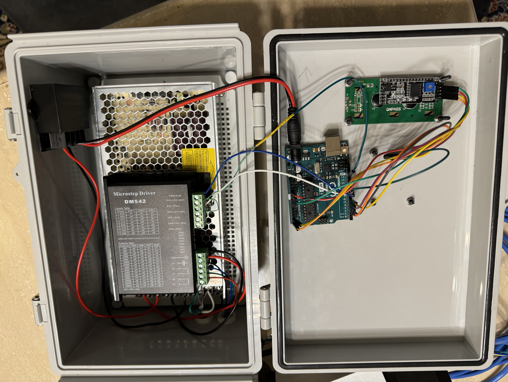
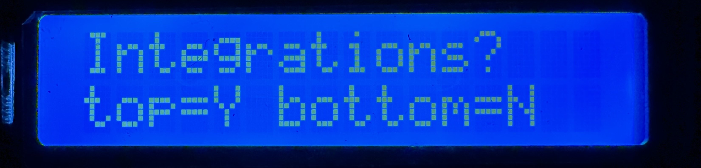
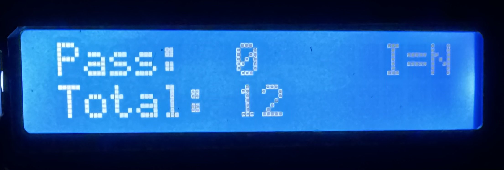
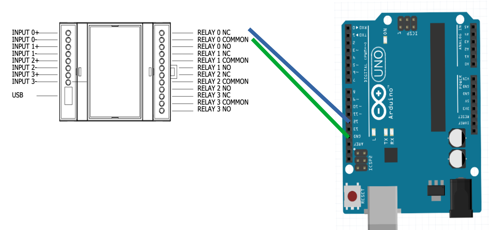
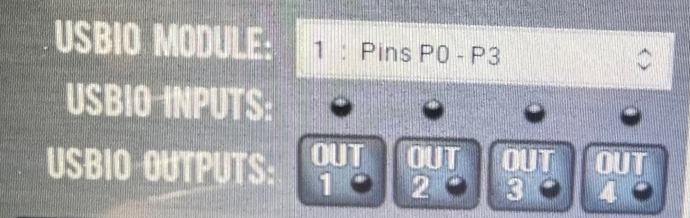

# Background

Wanted the ability to mill multiple sides of something (also known as 3+1 milling). For instance, to mill the chess piece the "knight", you need to mill multiple sides. Also, wanted the ability to cut gears, but did not really want to go the really manual dividing head route. When I saw this [video by Daniel Busby](https://www.youtube.com/watch?v=1Cl9l5O7EEI) , I was inspired to make something similar.

I already had this item: [4 jaw chuck](https://a.aliexpress.com/_mOB9M1P) for when I setup a 4th axis on a PrintNC, I just needed a way to drive it. Note that in the course of working on this project, I swapped out the motor to [this one](https://www.amazon.com/gp/product/B0B6N36NQJ).

I used double sided tape to hold the items in the project box. I also had to mill out the base of the chuck as they were slightly smaller than 3/8". I plan on using T-nuts to hold the chuck down on to the table.

Here it is in operation on a manual mill (with the chuck held in a vise):

The front of the project box:

# Components:
- [4 jaw chuck with stepper](https://a.aliexpress.com/_mOB9M1P) (went with 50:1 option)
- [stepper driver](https://www.amazon.com/gp/product/B07YWZRXGR)
- [Arduino Uno Rev3](https://www.amazon.com/dp/B008GRTSV6)
- [power supply](https://www.amazon.com/gp/product/B077BN32KZ)
- [power the arduino](https://www.amazon.com/dp/B07V6X6L89?ref=ppx_yo2ov_dt_b_product_details&th=1)
- [barrel connector](https://www.amazon.com/43x2pcs-Connectors-Security-Lighting-MILAPEAK/dp/B072BXB2Y8)
- [4 position connectors](https://www.amazon.com/gp/product/B083GR7FQF)
- [4 position keypad](https://www.amazon.com/gp/product/B07PFK5Z7L/)
- [LCD](https://www.amazon.com/dp/B07S7PJYM6)
- [box to hold everything](https://www.amazon.com/dp/B08282SQPT?ref=ppx_yo2ov_dt_b_product_details&th=1)
- [glands to keep it somewhat water resistant](https://www.amazon.com/dp/B09WQCF6TQ?ref=ppx_yo2ov_dt_b_product_details&th=1)
- [cables to make it easier to connect things](https://www.amazon.com/gp/product/B01EV70C78)

# Wiring:
- Arduino/LCD: 4 wires (5V power, ground, and two analog pins A4 and A5)
- Arduino/Keypad: 5 wires (ground, and 4 digital pins 3,4,5, and 6)
- Arduino/Stepper driver: 3 wires (ground, digital pins 8 and 9)
- Stepper motor/stepper driver: ensure each loop is together (in my case red/green is one loop, yellow/blue was the other loop); soldered on connector and cat 5 cable to make the cabling longer
- Power Supply/Stepper driver: red V+, black "ground" is V- ; there should be a green light on the stepper driver (the red light should be off); there should be a green light on the power supply
- Power Supply/Aruduino power(buck converter): red V+, black V-, DC barrel plug

# Buttons:
- first button reduces the total number of passes (**-Total**)
- second button increases the total number of passes (**+Total**)
- third button goes back to the prior pass (**-Pass**)
- fourth button advances to the next pass (**+Pass**)

Typical use would be to change the number of passes you would want (example: 30 if you want 30 teeth gear). Make the first cut, then press the **+Pass** button to advance the chuck for the next cut. If you need to go back, you can press the **-Pass** button.

Initial screen:

Main screen:
"I=N" means the "no integration" option was selected. It would show "I=Y" if the integrations option was selected.

# Tormach integration

Integrates with Tormach mill using their [USB M-Code I/O Interface Kit](https://tormach.com/usb-m-code-io-interface-kit-32616.html)

When you power this device, be sure to press the top button to indicated that the integrations is connected. There is an indicator on the top right of the screen "I=Y" means the integrations mode is enabled. If you specify integrations, but nothing is connected on pin12, then the chuck will randomly start spinning as the Arduino "read" provides random input. [For more info](https://www.arduino.cc/reference/en/language/functions/digital-io/digitalread/)

Wiring:

Connect the USB of the 32616 to the PathPilot computer. Go into settings and enable the "USB IO Kit". Go to the Status tab to see logging as well as new buttons:

Send GCODE "M64 P0" to do the same as the **Pass+** button. Be sure to send the "M65 P0" on a different line, but soon after. Pressing the "OUT1" button is the same as sending the GCODE.

# Files:
- source code: [passes.ino](passes.ino)
- [lcd_faceplate.stl](lcd_faceplate.stl)
- [keypad_faceplate.stl](keypad_faceplate.stl)
- wiring diagram: [wiring.odg](wiring.odg)
- documentation for front of box: [boxdoc.odt](boxdoc.odt)

# keywords:
gear cutting, poor man's fourth axis, automated dividing head, tormach, mill, USB io, arduino, index table, dividing head, gears, 3+1
